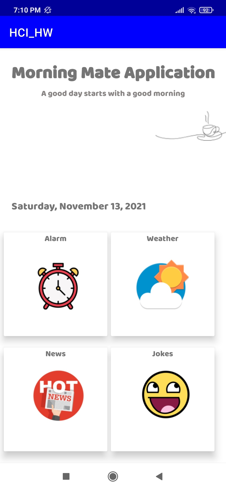

# MorningMateApplication
It's an university project for the subject Human Computer Interface.

# The application
This application is a Morning Application, which has alarm function, it provides the user the news and weather information and it can tell you jokes too. That application contains 4+1 application, let's see them. 

## Main Screen

The Main Screen navigation between functions, which are actually independent apps. On top we can see the name of the application and our slogen, little bit downer there's today's date, and in the bottom there's the funcs.   

 
