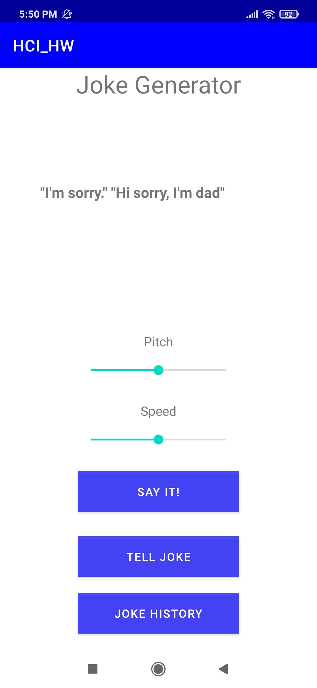

# MorningMateApplication
It's an university project for the subject Human Computer Interface.

# The application
This application is a Morning Application, which has alarm function, it provides the user the news and weather information and it can tell you jokes too. That application contains 4+1 application, let's see them. 

## Main Screen

The Main Screen navigation between functions, which are actually independent apps. On top we can see the name of the application and our slogen, little bit downer there's today's date, and in the bottom there's the funcs.   

 

## Alarm App

Alarm App is a simple alarm application, we can set alarms here. It has all the functionalities, like choose ringtones and periodicity of the alarm, etc.

 

## Weather App

It's a weather app, it shows the current weather, sunrise, sunset, etc. We can search between cities.

 

## News App

It's a news app, we can see through the necessary articles, we can also separate them between topics. 
The available topics are:

* All
* Technology
* Science
* Sports
* Generic
* Business
* Entertainment
* Health

 

## Jokes App

It's a joke app, it can show jokes on the Display and with the press of the "Say it!" button, a kind woman voice will it read up for us (we can choose the pitch and the speed of the speaker).

 
